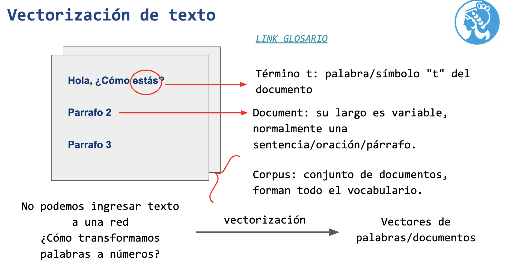
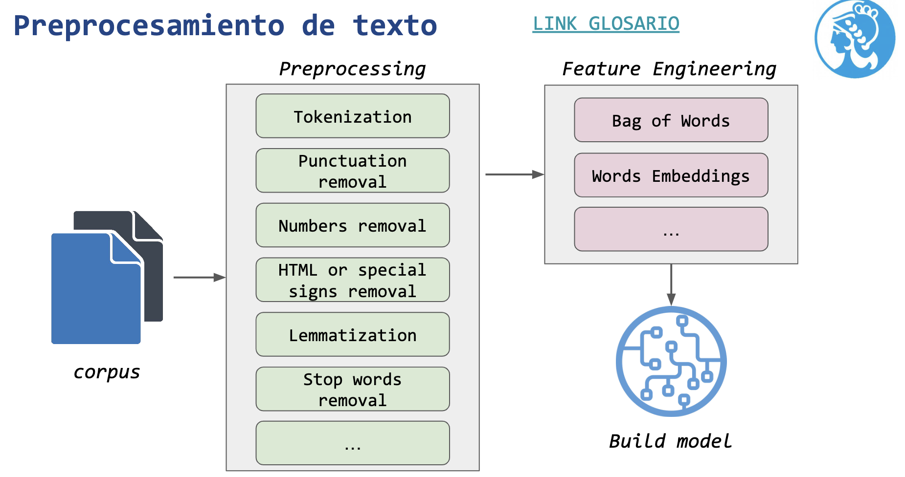
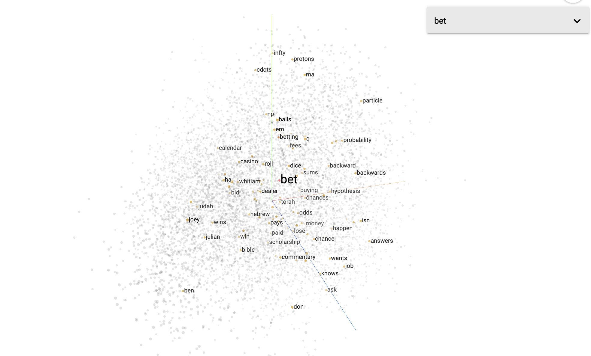
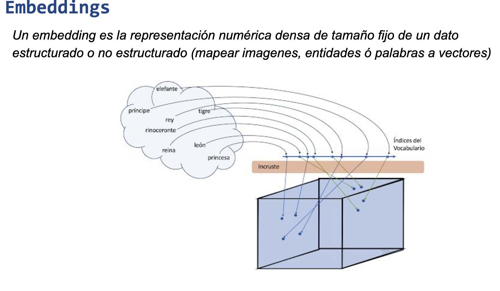
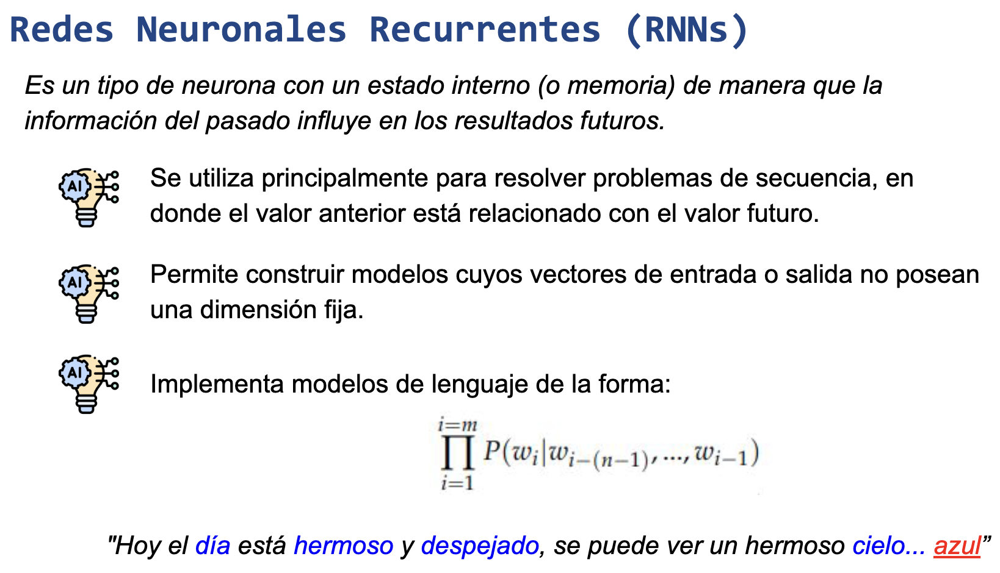
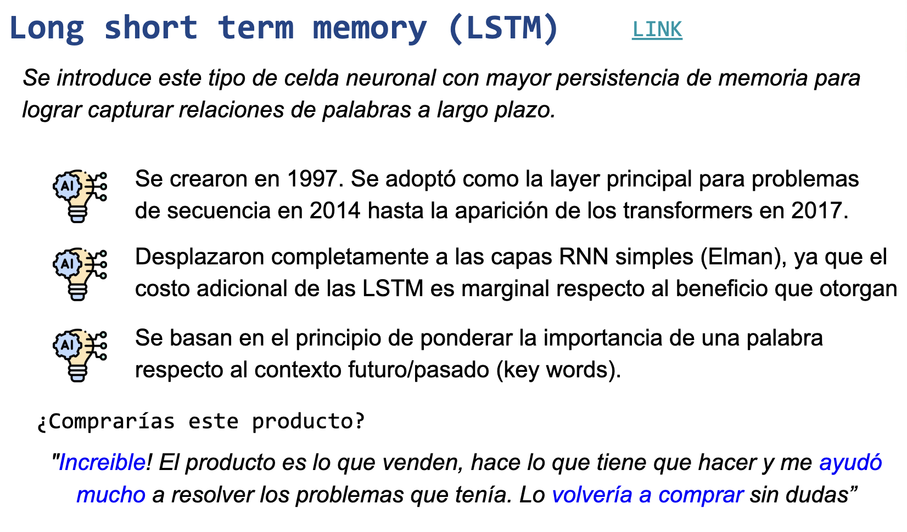
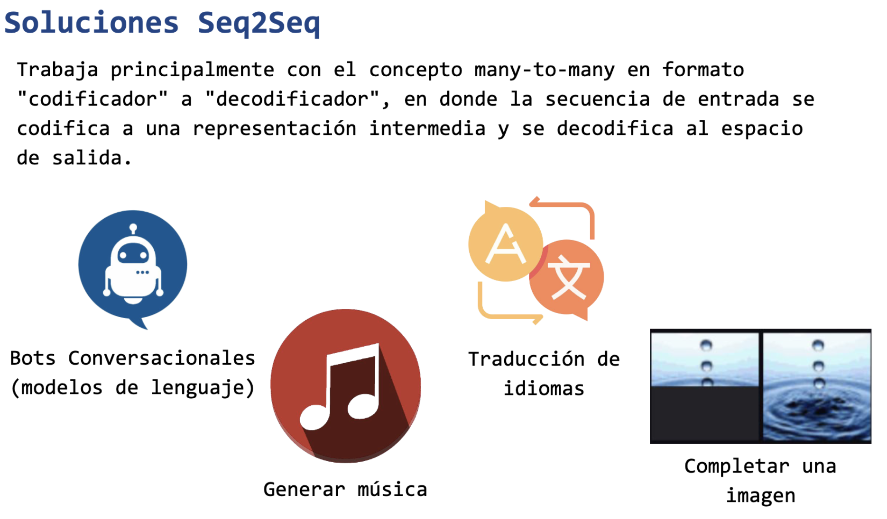

# Bienvenidos a nuestro Repo de NLP!

## En este repo damos varios tipos de algoritmos de NLP desde lo mas simple a modelos mas complejos.

### En la Clase 1 trabajamos con : Vectorización de documentos
En donde aprendimos a obtener el vocabulario del corpus (los términos utilizados)\
Luego dada una lista de textos, devolver una matriz con la representación oneHotEncoding de estos
tambien dada una lista de textos, devolver una matriz con la representación de frecuencia de estos
Y por ultimo realizamos una funcion que reciba el corpus y el índice de un documento y devuelva los documentos ordenados por la similitud coseno

### Clase 2 : Preprocesamiento de texto
En esta clase construimos nuestro propio chatbot basado en un ejemplo dado en clase.

### Clase 3 : Word Embeddings
En esta clase comenzamos a trabajar on Embeddings..
Creamos nuestros propios vectores con Gensim basados en lo visto en clase con otro dataset.

### Clase 4 : Redes neuronales recurrentes (RNNs)
En esta clase pusimos en practica modelos de prediccion de proxima palabra utilizando
Redes neuronales recurrentes

### Clase 5 : Redes Long short term memory (LSTM)
Aqui utilizamos redes LSTM + Embeddings para clasificar críticas de compradores de ropa.

### Clase 6 : Redes Sequence to Sequence (seq2seq)
En esta ultima clase construimos un QA Bot basado en el ejemplo del traductor pero con un dataset QA.
